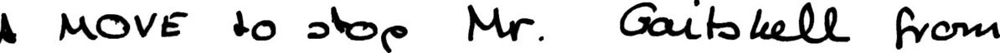

# Line_HTR

gMLP layers and Bidirectional LSTM decoder stacked on a multilayer CNN for image-to-transcription.

This repository is associated with the paper ["gMLP guided Deep Networks Model for Character-based Handwritten Text Transcription"](url).

Please cite the paper if you use this code for academic research:

```

```

# Acknowledgements

IAM image and transcription preprocessing from [Laia](https://github.com/jpuigcerver/Laia/).

# Prerequsites

### Python 3 (tested on Python 3.7)

### Tensorflow 2 (tested on 2.1.0)

### Required packages: {editdistance, Levenshtein, openCV 2, pillow, matplotlib, scikit-image}:

```
pip3 install {package}
```

# Image-to-transcription on IAM:

### Data Preparation
Follow steps for [IAM data preparation](https://github.com/jpuigcerver/Laia/tree/iam_new/egs/iam#data-preparation). IAM consists of approx. 10k images of handwritten text lines and their transcriptions. The code in the linked repo binarizes the images in a manner that preserves the original grayscale information, converts to JPEG, and scales to 64 pixel height. The code creates a folder for preprocessed images `imgs_proc` and transcriptions `htr/lang/char`.




Create a file `train.txt` from the transcription `tr.txt` that replaces whitespace with a vertical pipe and contains the path of images and the corresponding characters, e.g.:

```
a01-000u-00.jpg A|MOVE|to|stop|Mr.|Gaitskell|from
a01-000u-01.jpg nominating|any|more|Labour|life|Peers
a01-000u-02.jpg is|to|be|made|at|a|meeting|of|Labour
```
Also create files `val.txt` and `test.txt` from `htr/lang/word/va.txt` and `htr/lang/word/te.txt`, respectively, following the same format as above. 

Assume that the working directory is `Attention-OCR`. The data files within `Attention-OCR` should have the structure:

- `data`
- `iam`
  - `lines` (folder of JPEG images)
  - `train.txt`
  - `lines_val.txt`
  - `lines_test.txt`

### Train

```
python run.py 

```
